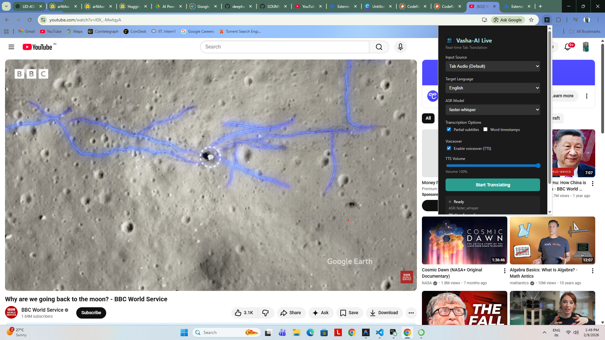
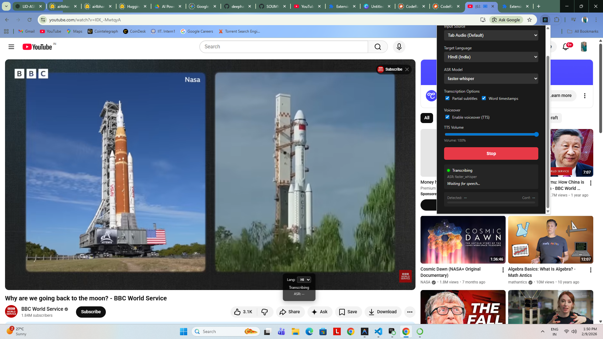
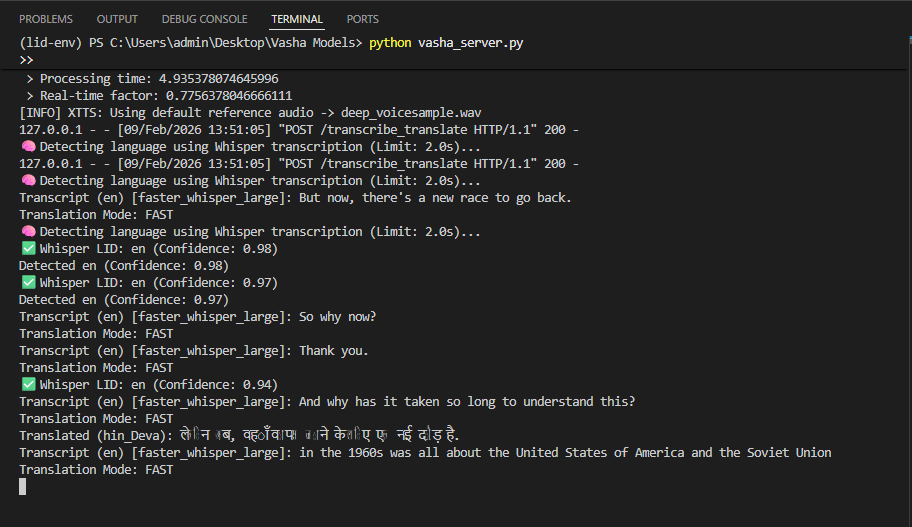
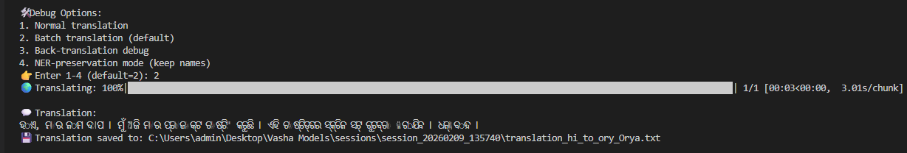

# Vasha AI Models

Core repository for the Vasha AI speech pipeline:

- `LID` (language identification)
- `ASR` (speech to text)
- `MT` (text translation)
- `TTS` (text to speech)
- Chrome extension backend integration

This repo is designed to run from CLI for local testing and from `vasha_server.py` for browser extension use.

## Repository Layout

```text
Vasha Models/
|- ASR_Model/
|- LID_Model/
|- MT_Model/
|- TTS_Model/
|- chrome_extension/
|- diagrams/
|- transcribe_pipeline.py
|- vasha_server.py
|- verify_server.py
|- requirements.txt
```

## Prerequisites

- OS: Windows/Linux/macOS
- Python: 3.10 recommended
- CUDA GPU recommended for real-time performance (CPU also works, slower)
- FFmpeg available in PATH (required for some audio/video flows)

## Environment Setup (CLI)

### 1) Create and activate environment

```bash
conda create -n lid-env python=3.10 -y
conda activate lid-env
```

### 2) Install dependencies

```bash
pip install -r requirements.txt
```

If `flask-sock` or API docs packages are missing:

```bash
pip install flask flask-cors flasgger flask-sock
```

## Run the Backend Server (for extension + API)

From repo root:

```bash
python vasha_server.py
```

Server endpoints:

- `http://127.0.0.1:5000/health`
- `http://127.0.0.1:5000/docs` (Swagger UI)
- `ws://127.0.0.1:5000/stream_audio` (WebSocket ASR stream)

## Verify Backend

```bash
python verify_server.py
```

Or with curl:

```bash
curl http://127.0.0.1:5000/health
```

## Run CLI Pipeline (without extension)

`transcribe_pipeline.py` supports local file, microphone, and YouTube flows.

### Local file

```bash
python transcribe_pipeline.py --file path/to/audio_or_video.mp4
```

### Microphone

```bash
python transcribe_pipeline.py --mic --duration 10
```

### YouTube

```bash
python transcribe_pipeline.py --youtube https://youtu.be/<video_id>
```

## Chrome Extension (MV3) Local Setup

1. Open `chrome://extensions`
2. Enable `Developer mode`
3. Click `Load unpacked`
4. Select `chrome_extension/`
5. Pin extension icon
6. Start backend first: `python vasha_server.py`
7. Open an audio tab (YouTube, etc.), open popup, click `Start`

Notes:

- Popup settings are persisted locally.
- If backend is unavailable, extension auto-stops capture after repeated failures.

## Troubleshooting

### `Failed to fetch` in extension

- Confirm backend running on `127.0.0.1:5000`
- Check `http://127.0.0.1:5000/health`
- Reload extension after server restarts

### Extension appears to keep transcribing after server restart

- Stop from popup once
- Reload extension from `chrome://extensions`
- Ensure only one backend instance is running

### Icon not visible

- Keep manifest icon paths consistent with files in `chrome_extension/`
- Reload extension after icon changes

## Diagrams

This repository keeps architecture and flow images under `diagrams/`.

### Core Pipeline


### Chrome Extension and Backend Flow






### Output Examples




## Authoring Notes

- Keep CLI commands reproducible from repo root.
- Keep diagrams in `diagrams/` and reference with relative markdown paths.
- Keep extension-specific details in `chrome_extension/`.
