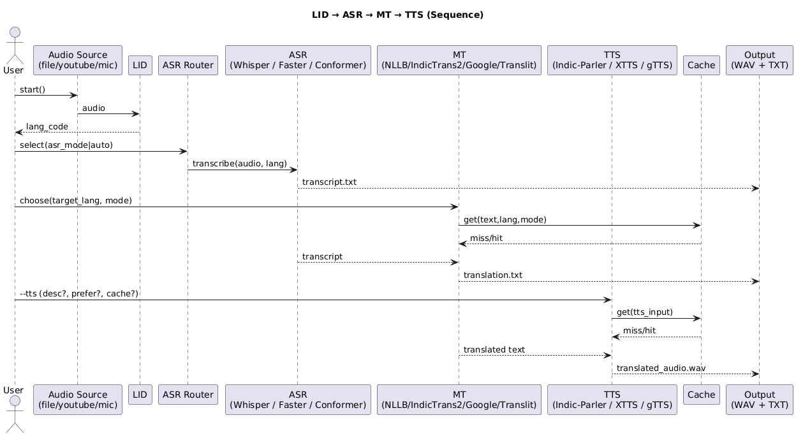
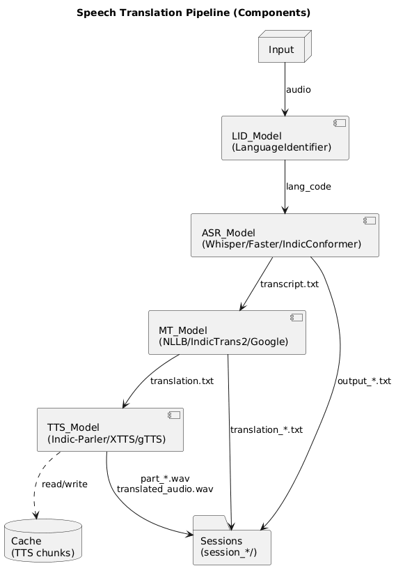

# 🎧 Vasha-AI — Real-Time AI Speech Translation System

> 🧠 **Vasha-AI** is an intelligent multilingual pipeline that performs **real-time speech-to-speech translation** across 200+ global and Indic languages.
> It integrates **Automatic Speech Recognition (ASR)**, **Language Identification (LID)**, **Machine Translation (MT)**, and **Text-to-Speech (TTS)** with features like **NER-preservation**, **code-mixed handling**, **transliteration**, and **spoof detection**.

This repository hosts the **core ASR/LID/MT/TTS models and pipeline** that power the production Vasha web experience.

---

## 📺 Demo Video

You can watch a short **demo of Vasha-AI in action** here:  
[Vasha-AI Demo on YouTube](https://youtu.be/16qauRDXsOg)

---

## 🌍 Key Features

✅ **Real-Time Language Identification (LID)**
✅ **Automatic Speech Recognition (ASR)** with:

* OpenAI **Whisper**
* AI4Bharat **IndicConformer**
* **Faster-Whisper** (batched inference)

✅ **Machine Translation (MT)** with:

* Meta **NLLB (No Language Left Behind)**
* AI4Bharat **IndicTrans2**
* **Google Translate** API wrapper

✅ **Text-to-Speech (TTS)** via a unified backend:

* Indic-Parler (Indic voices)
* Coqui **XTTS**
* **gTTS** with caching & chunking

✅ **Smart Preprocessing**:

* Named Entity Preservation (NER)
* Script Transliteration
* Code-Mixed Text Handling (e.g., Hinglish)

✅ **Advanced Debugging**:

* Back-Translation Consistency Check
* NER Preservation Mode
* Transliteration-only Mode

✅ **Security**:

* Spoof Detection for fake audio
* Dialect tagging (Hindi, Tamil, Bengali, etc.)

✅ **UX Improvements**:

* Real-time progress bars (`tqdm`)
* Session-wise results saved locally

---

## 🧩 Project Directory Structure

```
Vasha-Models/
│
├── ASR_Model/
│   └── indic_conformer/
│       └── conformer_asr.py         # AI4Bharat IndicConformer ASR wrapper
│
├── LID_Model/
│   ├── lid.py                       # Language ID + dialect detection
│   ├── spoof_detection.py           # Spoof detection
│   ├── requirements.txt
│
├── MT_Model/
│   ├── mt_model.py                  # Unified translation model loader (NLLB, etc.)
│   ├── mt_helper.py                 # Menu + progress bar integration
│   ├── mt_google.py                 # Google Translate API
│   ├── mt_preprocessor.py           # NER, transliteration, code-mix logic
│   ├── mt_debug.py                  # Back-translation utilities
│   └── nllb-3.3B/                   # Meta NLLB model assets
│       ├── README.md
│       └── sentencepiece.bpe.model
│
├── TTS_Model/
│   ├── tts_common/                  # Shared TTS interface & utilities
│   └── tts_cache/                   # Cached synthesized audio
│
├── diagrams/                        # Architecture & speech-translation flowcharts
├── output_tts/                      # Example synthesized waveforms
│
├── transcribe_pipeline.py           # Main end-to-end pipeline script
├── gpusage.py                       # GPU usage tracker
├── requirements.txt                 # Global dependencies
└── readme.md                        # You're reading this file
```

---

## 🧠 System Architecture

```
🎤 Audio Input
   │
   ├──► Language Identification (LID_Model)
   │      ├── Language & Dialect Detection
   │      └── Spoof Detection (Fake vs Real)
   │
   ├──► Automatic Speech Recognition (ASR_Model)
   │      ├── Whisper / Faster-Whisper / IndicConformer
   │      └── Converts Speech → Text
   │
   ├──► Machine Translation (MT_Model)
   │      ├── NLLB / IndicTrans2 / Google
   │      ├── Transliteration / Code-mixed / NER-Preserve
   │      └── Progress bar + batching (tqdm)
   │
   └──► Output
          ├── Translated Text
          ├── Saved Transcription Files
          └── Optional Back-Translation Debug
```

---

## 🖼 Architecture & Flowcharts



This diagram shows the **high-level model pipeline**, starting from raw audio input and flowing through LID, ASR, MT, and optional TTS to produce translated speech and text.



This diagram focuses on the **end-to-end speech translation experience**, illustrating how user audio moves through the backend services to the production web frontend.

---

## 🌐 Production Website & Frontend

- **Production web app repo**: [`vasha-website`](https://github.com/SOUMYADEEPDUTTACODER/vasha-website) — TypeScript + Vite frontend and Python backend wiring for deploying these models in production.  
- **Live website**: [`https://vasha-website.vercel.app/`](https://vasha-website.vercel.app/) — main Vasha AI experience powered by this models repository.

---

---

## 🧩 Vasha-AI Chrome Extension (New!)

The project now includes a powerful **Manifest V3 Chrome Extension** that brings Vasha-AI directly to your browser throughout the web.

### ✨ Extension Features
*   **Real-Time Tab Audio Capture**: Capture audio from YouTube, Twitch, Meet, or any HTML5 audio source.
*   **Live Translation Overlay**: View translated text in real-time within the extension popup.
*   **Visual LID Timeline**: A dynamic color-coded timeline that visualizes language changes (e.g., Hindi → English → Bengali) in real-time.
*   **Mixed Mode**: Capture both **Tab Audio** and **Microphone** simultaneously for interviews or reaction videos.
*   **State Persistence**: Recording state and transaction history are saved even if the popup closes.

### 🚀 Setting up the Extension
1.  Open Chrome and navigate to `chrome://extensions`.
2.  Enable **Developer Mode** (toggle in top right).
3.  Click **Load Unpacked**.
4.  Select the `chrome_extension` directory from this repository.
5.  Pin the **Vasha-AI** icon to your toolbar.

### 🎮 Using the Extension
1.  Start the backend server: `python vasha_server.py`.
2.  Open a tab with audio (e.g., a YouTube video).
3.  Click the Vasha extension icon.
4.  Select your **Target Language** (e.g., Hindi).
5.  Click **▶ Start Translating**.
6.  The extension will capture audio, identify the language, and display the translation instantly.

---

## ⚙️ Installation

### 1️⃣ Clone the repository

```bash
git clone https://github.com/<your-username>/Vasha-AI.git
cd Vasha-AI
```

### 2️⃣ Create a new environment

```bash
conda create -n lid-env python=3.10 -y
conda activate lid-env
```

### 3️⃣ Install dependencies

```bash
pip install -r requirements.txt
```

### 4️⃣ (Optional) Install extra packages for IndicTrans2 & NLLB

```bash
pip install torch torchvision torchaudio
pip install transformers sentencepiece sacremoses accelerate
```

---

## 🎤 Running the Pipeline

### ▶️ Real-Time Microphone Translation

```bash
python transcribe_pipeline.py --mic --duration 10
```

### ▶️ Translate YouTube Videos

```bash
python transcribe_pipeline.py --youtube https://youtu.be/<video_id>
```

### ▶️ Process a Local File

```bash
python transcribe_pipeline.py --file sample_video.mp4
```

---

## 🧪 Debugging Options

| Option                   | Description                              |
| ------------------------ | ---------------------------------------- |
| **1**                    | Normal Translation                       |
| **2**                    | Batch Translation (with progress bar)    |
| **3**                    | Back-Translation Debug                   |
| **4**                    | NER-Preservation Mode                    |
| **Transliteration Mode** | Converts script without changing meaning |
| **Code-Mixed Mode**      | Handles bilingual runs like Hinglish     |

---

## 🧾 Example Output

```
🕣 Transcribed Text:
 नमस्ते मेरा नाम दीप है...

💬 Translation (Hindi → English):
 Hello, my name is Deep...

💾 Saved to:
 sessions/session_20251027_142512/translation_hi_to_eng_Latn.txt
```

---

## 💡 Advanced Features

| Feature              | Description                                        |
| -------------------- | -------------------------------------------------- |
| **Progress Bar**     | `tqdm` integrated into translation chunks          |
| **NER Preservation** | Keeps named entities (people, places) untranslated |
| **Back-Translation** | Validates translation consistency                  |
| **Spoof Detection**  | Flags fake/AI-generated voices                     |
| **GPU Monitoring**   | Optional `gpusage.py` shows CUDA stats             |

---

## 🦉 Example Session Folder

```
sessions/session_20251027_142512/
├── output_hi_whisper.txt
├── translation_hi_to_eng_Latn.txt
└── debug_log.txt
```

---

## 🧑‍💻 Development Notes

* Each module is fully independent (LID, ASR, MT).
* Uses **Whisper** or **IndicConformer** dynamically based on detected language.
* **Meta NLLB** is default global MT model; falls back to **IndicTrans2** for Indic pairs.
* Integrated **tqdm progress bar** for smoother user experience during long translations.

---

## 🔋 Requirements

```
torch
torchaudio
transformers
tqdm
sentencepiece
sacremoses
faster-whisper
indic-nlp-library
langid
spacy
flask
pydub
openai-whisper
```

---

## 🧱 Future Enhancements

* Real-time subtitle overlay for YouTube/Twitch streams
* Flask/FastAPI dashboard
* Speaker diarization
* Multi-GPU batch processing
* Offline IndicTrans2 quantization

---

## 👨‍💻 Author

**Deep Habiswashi**
**Soumyadeep Dutta**
**Sudeshna Mohanty**


---

## 🪄 License

```
MIT License © 2025 Deep Habiswashi
```


